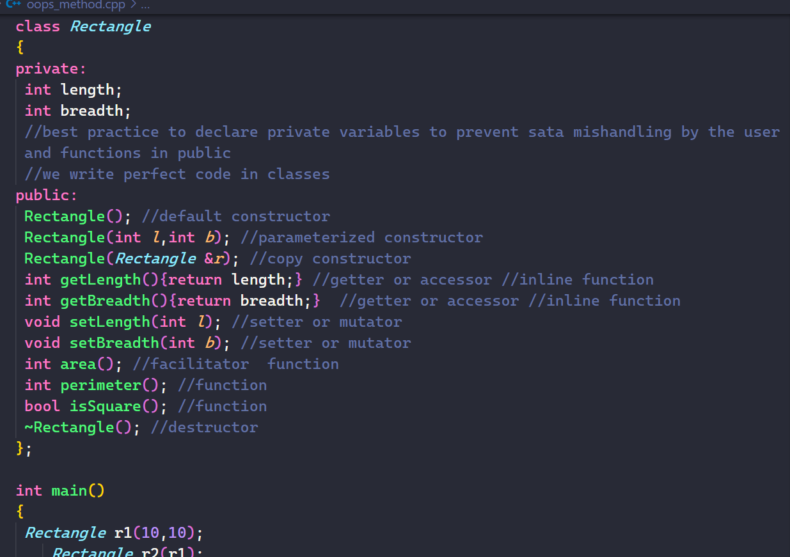
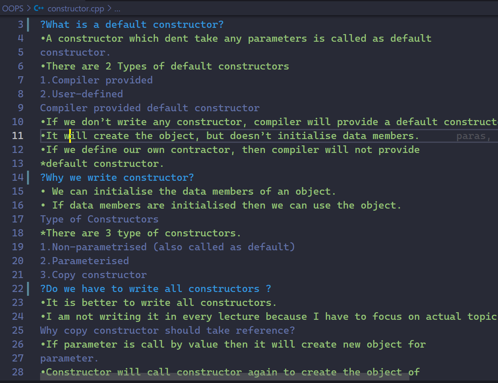
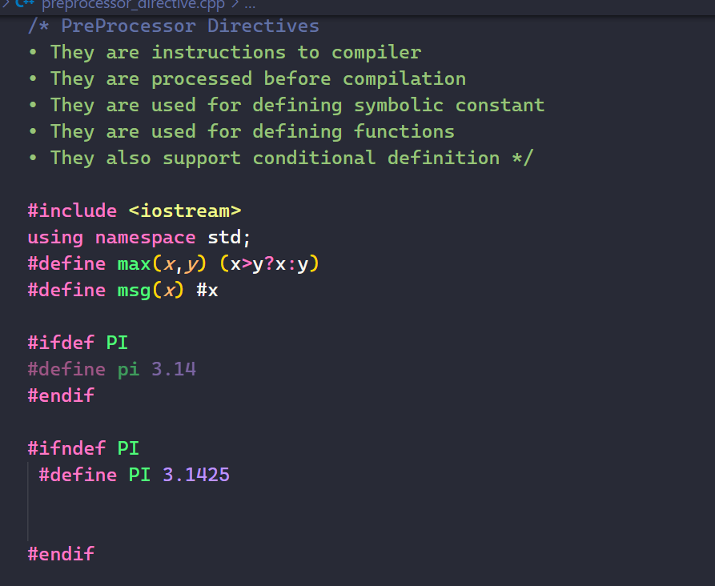

# Introduction To C++ Programming language

[](https://git.io/typing-svg)<br />

This repository contains notes and practice files from the [C++ course on Udemy](https://www.udemy.com/course/cpp-deep-dive/) by Mr Abdul Bari.
Efforts were made to make the files as readable as possible, by Commenting the code and adding explanations still there is room for improvement.







## Description

The course addresses the requisite basic concepts of [C++ programming language](https://en.wikipedia.org/wiki/C%2B%2B) and was hence underwent in order to strengthen and formalize what I had known beforehand

For other Advanced Concepts and practice problems, I have created
#### [Data Structures and Algorithms Repository[In progress]](https://github.com/parasguglani1/DSA_Practice)
#### [Additional Problems in competitive programming](https://github.com/parasguglani1/competitive_coding)


### Table of contents

| Sr. No  | Topics Covered in this course                                               |
| ------- | --------------------------------------------------------------------------- |
| 1.      | [basics](./basics)                                                          |
| 2.      | [OOPS](./OOPS)                                                              |
| 2. i)   | [Operator Overloading](./OOPS/operator_overloading)                         |
| 2. ii)  | [Inheritance](./OOPS/inheritance)                                           |
| 2. iii) | [Friend Function and static Keyword](./OOPS/friend_and_static/friend_class) |
| 2. iv)  | [Polymorphism](./OOPS/polymorphism/)                                        |
| 3.      | [Exception Handling](./exception_handling/)                                 |
| 4.      | [File Handling](./file%20handling/)                                         |
| 5.      | [CPP11 features](./CPP11%20features/)                                       |
| 6.      | [Problems](/practice%20problems/)                                           |
| 7.      | [Student Project - Banking System](./Project/banking_system.cpp)            |
| 8.      | [C++ Notes ](./C++%20Notes.md)            |
| 9.      | [Advanced C++ Notes ](./Advanced-C++%20Notes.md)            |
## :arrow_down: Installation

- First, fork this repository :fork_and_knife: and follow the given instructions:

```bash
# clone the repository to your local machine
$ git clone https://github.com/<YOUR-GITHUB-USERNAME>/CPP_Practice.git

# navigate to the project's directory and install all the relevant dev-dependencies
$ cd CPP_Practice

# include all the latest changes from the remote repository
$ git remote add upstream https://github.com/parasguglani1/CPP_Practice
$ git fetch upstream
$ git merge upstream/master
```

### Resources Used

- [C++ course on Udemy](https://www.udemy.com/course/cpp-deep-dive/) by Mr Abdul Bari.
- [Microsoft VS Code](https://code.visualstudio.com/) for typing and executing these files.
- [C/C++ for Visual Studio Code](https://github.com/Microsoft/vscode-cpptools) and [Code Runner](https://github.com/formulahendry/vscode-code-runner) for faster execution in terminal.
- [Better Comments](https://github.com/aaron-bond/better-comments) for comment highlighting.

## Contributing

> Think you're ready :grey_question: Make the PR :tropical_drink:

- Add your changes in the respective folder
- Once you have made your changes, run the following command:

```bash
# add your changes
$ git add .

# make your commit
$ git commit -m "<YOUR-COMMIT-MESSAGE>"

# push your changes
$ git push -u origin master  #for first time push
$ git push                   #from second push onwards
```

- open your forked repository
- Click on Create New Pull Request
- Give a message in the comment box about the PR
- Hurrah!! Your PR made! Wait for your PR to be evaluated and merged.

## License

See the [LICENSE](https://github.com/parasguglani1/CPP_Practice/blob/master/LICENSE) for details.

## Contact

[@parasguglani1](https://github.com/parasguglani1) is the sole author of this repository.
Feel free to contact me on [Linkedin](https://www.linkedin.com/in/parasguglani/) or [Mail](mailto:parasguglani1@gmail,com)
